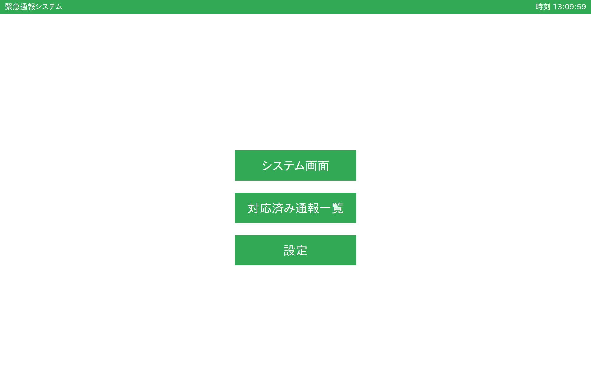
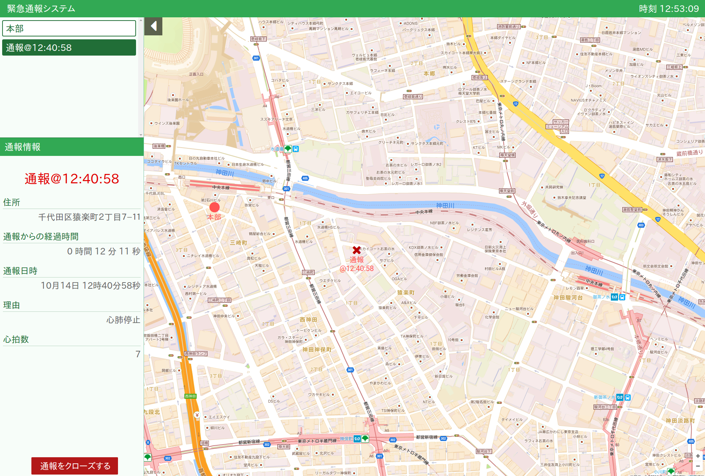
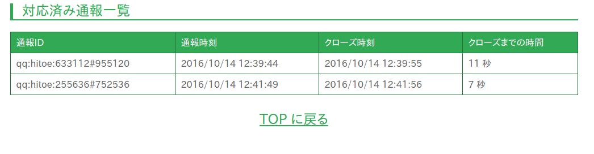
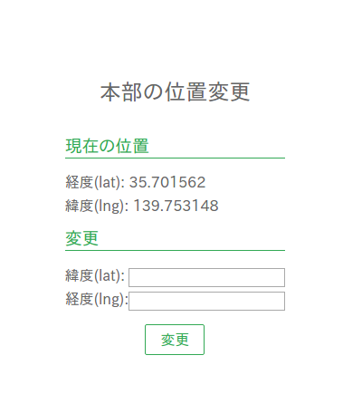

# hec-jissho1 の使い方

[hec-jissho1](https://hec-jissho1.herokuapp.com) (リンク先はとりあえず Heroku)

## 1. はじめに

+ PCなら Chrome 推奨（Firefox可）
+ スマホ、タブレットでも閲覧できる

## 2. 画面説明

4 つの画面がある。

### 画面1: Top ページ

+ ヘッダーの「緊急通報システム」が TOP ページへのリンクになっている。TOP に戻るときにはいつでもここをクリック。
+ システム画面 ... メインのシステム
+ 対応済み通報一覧 ... 隊員が到着するなどして対応済みとなった通報の一覧が見られる
+ 設定 ... 本部の位置を緯度・経度を指定して設定できる。(任意の場所の緯度・経度は Google Map を使うと調べられる)

### 画面2: システム画面

左側が情報欄。情報欄は開閉できる。

左上にある項目(「本部」「通報」など)をクリックすると、項目の情報が表示されるとともに、地図上にある項目を地図中央表示させる。通報が地図上でどこにあるかわからなくなったら、「通報」項目をクリックすればよい。

### 画面3: 対応済み通報一覧

対応済み通報一覧。それぞれの通報から到着までの秒数がわかる。

### 画面4: 設定

本部の場所を設定できる。経度と緯度を入力する。任意の場所の経度と緯度を調べるには、たとえば [Google Map](https://www.google.co.jp/maps) を開いて適当な場所を右クリックし、「この場所について」を選択する。すると、経度と緯度が表示される。

## 3. 通報の流れ

1. 通報が来ると自動的に警報がなる。
2. 救急隊が到着したら、本部にいる人が通報情報の下部分にある「クローズ」を押す。
3. 通報をクローズすると通報から到着までの時間が記録される。
4. クローズされた通報の情報は「対応済み通報一覧」で閲覧できる。

## 4. 注意事項

通報のクローズは隊員のタブレットからではなく、本部の PC からのみ行う。理由は、現バージョンでは通報がクローズされたという状態がブラウザ間で共有できないから。
